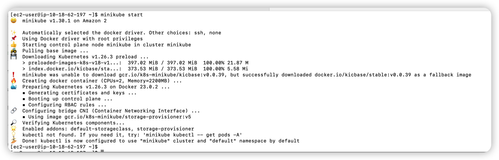

# exam-minikube


My EC2 configuration:
- 2 CPUs
- 8GB of free memory
- 30GB of free disk space

## EXAM STEP
---
### Step 1 install local k8s with minikube
reference documents: 
- https://kubernetes.io/zh-cn/docs/tutorials/hello-minikube/
- https://minikube.sigs.k8s.io/docs/start/
- https://kubernetes.io/zh-cn/docs/tasks/tools/install-kubectl-linux/

install docker 
```
sudo yum install docker -y
sudo usermod -aG docker ec2-user #after run this command, need to open a new shell command terminal, then user ec2-user will have access to run docker command like 'docker version'
sudo systemctl start docker 
sudo systemctl enable docker
```
install minikube
```
curl -LO https://storage.googleapis.com/minikube/releases/latest/minikube-linux-amd64
sudo install minikube-linux-amd64 /usr/local/bin/minikube
minikube start
```


install kubectl
```
curl -LO "https://dl.k8s.io/release/$(curl -L -s https://dl.k8s.io/release/stable.txt)/bin/linux/amd64/kubectl"
sudo install -o root -g root -m 0755 kubectl /usr/local/bin/kubectl
```

check kubectl
```
kubectl version --client
```


check kube cluster
```
kubectl get po -A
```

---
### Step 2 Develop a simple Helm chart

please check files under dir ./exam_chart/
---
### Step 3 Deploy the Helm chart and verify
install helm
reference documents: https://helm.sh/zh/docs/intro/install/
```
wget https://get.helm.sh/helm-v3.12.0-linux-amd64.tar.gz
tar -zxvf helm-v3.12.0-linux-amd64.tar.gz
sudo cp linux-amd64/helm /usr/local/bin/helm
helm version
```


helm install chart
```
helm install hello ./exam_chart
```


port-forward service 
```
kubectl port-forward service/hello-service 8080:80
```

open a new terminal and access service
```
curl 127.0.0.1:8080
```

---
### Step 4 Install Loki in the K8s cluster with Helm
#it's my first tiem to install loki.

reference documents:  
- https://grafana.com/docs/loki/latest/installation/helm/install-scalable/
- https://juejin.cn/post/7198826344582135866
```
helm repo add grafana https://grafana.github.io/helm-charts 
helm repo update
helm install --values loki_values.yaml loki grafana/loki
```

